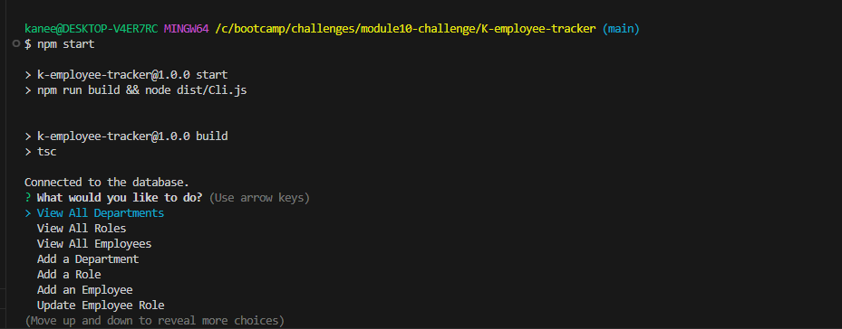

# K-employee-tracker
  
  ## Description
  This application will give you the ability to track employees, roles, and department by using the terminal. This application used inquirer to access the database through the terminal. You have the ability to view and add new employees, roles, and department. Updating the role of an employee will also be an option.
  ## Table of Contents
  * [Installation](#installation)
  * [Usage](#usage)
  * [Credits](#credits)
  * [License](#license)
  * [Badges](#badges)
  * [Features](#features)
  * [How to Contribute](#howToContribute)
  * [Test](#test)
  ## Installation
  * Do a gitclone on the repository through github.
  * Make sure you have package.json file with the dependencies listed.
  * In your terminal, make sure to be in the repository directory.
  * Do: "npm install", "npm start", then follow the directions once the inquirer has started on the terminal.
  ## Usage
  Once you do "npm start" in your terminal, your terminal should start the application and look like the following image:   
  ## Credits
  N/A
  ## License
  MIT 
  ## Badges
  N/A
  ## Features
  * When you open the terminal and input "npm start" you will be given multiple actions you can do on the application.
  * The actions that you can do in the applicaitons include view department, view roles, view employee, add department, add roles, add employee, and update an employee role.
  ## How to Contribute
  You can reach out to me on the
  ## Video Demo or Test
  Here is the demo: 
  ## Questions
  Contact:
  * Name: Kane Esasta
  * Email: kaneesasta@gmail.com
  * Github: [kaneganteng](https://github.com/kaneganteng)